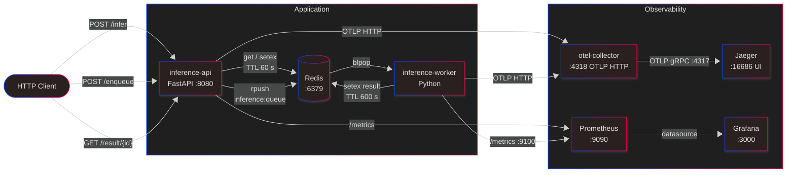

# Online Inference Platform Demo

A production-pattern demo of a real-time ML inference platform. It covers the full stack: synchronous inference with cache-aside, asynchronous event-driven job processing, distributed tracing, Prometheus metrics, Grafana dashboards, Kubernetes deployment with HPA and KEDA autoscaling, and a Helm chart.

---

## Architecture



### Components

| Service | Image | Port(s) | Role |
|---|---|---|---|
| `inference-api` | local build | 8080 | Synchronous inference, enqueue, result poll |
| `inference-worker` | local build | 9100 (metrics) | Async queue consumer, writes results to Redis |
| `redis` | redis:7-alpine | 6379 | Cache-aside store + job queue |
| `otel-collector` | otel/opentelemetry-collector:0.104.0 | 4318 (OTLP HTTP) | Receives traces, exports to Jaeger |
| `jaeger` | jaegertracing/all-in-one:1.57 | 16686 (UI), 4317 (OTLP gRPC) | Distributed trace storage + UI |
| `prometheus` | prom/prometheus:v2.55.0 | 9090 | Scrapes `/metrics` from both services |
| `grafana` | grafana/grafana:11.1.4 | 3000 | Pre-provisioned dashboard |

---

## Quick Start (Docker Compose)

**Prerequisites:** Docker Desktop with Compose v2.

```bash
docker compose up --build
```

All services start together. On first run, images are built from source. Subsequent runs skip the build unless `--build` is passed.

**Service URLs after startup:**

| URL | What it is |
|---|---|
| http://localhost:8080/docs | Inference API — interactive Swagger UI |
| http://localhost:8080/metrics | Raw Prometheus metrics |
| http://localhost:16686 | Jaeger trace explorer |
| http://localhost:9090 | Prometheus query UI |
| http://localhost:3004 | Grafana dashboard (admin / admin) |

---

## API Reference

### `GET /healthz`

Liveness + Redis connectivity check.

```bash
curl http://localhost:8080/healthz
```

```json
{"ok": true, "redis": true}
```

---

### `POST /infer` — Synchronous NER inference

Hashes the request payload (`text` field) and checks Redis. On a cache miss, runs **Named Entity Recognition** with `dslim/bert-base-NER` and caches the result for 60 seconds. Identical inputs resolve from Redis in < 5 ms.

```bash
curl -s -X POST http://localhost:8080/infer \
  -H "Content-Type: application/json" \
  -d '{"text": "Carl Sagan was an American scientist and science communicator. Initially an assistant professor at Harvard, Sagan later moved to Cornell, where he was the David Duncan Professor of Astronomy and Space Sciences. He was born on November 9, 1934 in New York City"}' | jq
```

**First call (cache miss — real inference):**
```json
{
  "cache_hit": false,
  "result": {
    "entities": [
      {"text": "Carl Sagan", "label": "PER", "score": 0.9998},
      {"text": "American",   "label": "MISC","score": 0.9871},
      {"text": "Harvard",    "label": "ORG","score": 0.9752},
      {"text": "Cornell",    "label": "ORG","score": 0.9634},
      {"text": "November 9, 1934", "label": "DATE","score": 0.9512},
      {"text": "New York City", "label": "LOC","score": 0.9401}
    ],
    "model": "bert-base-NER"
  }
}
```

**Repeat identical call (cache hit — Redis only):**
```json
{
  "cache_hit": true,
  "result": {
    "entities": [
      {"text": "Carl Sagan", "label": "PER", "score": 0.9998},
      {"text": "American",   "label": "MISC","score": 0.9871},
      {"text": "Harvard",    "label": "ORG","score": 0.9752},
      {"text": "Cornell",    "label": "ORG","score": 0.9634},
      {"text": "November 9, 1934", "label": "DATE","score": 0.9512},
      {"text": "New York City", "label": "LOC","score": 0.9401}
    ],
    "model": "bert-base-NER"
  }
}
```

The `cache.hit` and `model.entity_count` attributes are both visible as span tags in Jaeger.

---

### `POST /enqueue` — Async job submission

Pushes a job onto the `inference:queue` Redis list and returns a `job_id`. The worker picks it up via `BLPOP`, runs NER, and writes the result back to Redis.

```bash
JOB=$(curl -s -X POST http://localhost:8080/enqueue \
  -H "Content-Type: application/json" \
  -d '{"text": "Carl Sagan was an American scientist and science communicator. Initially an assistant professor at Harvard, Sagan later moved to Cornell, where he was the David Duncan Professor of Astronomy and Space Sciences."}')

echo $JOB
# {"accepted": true, "job_id": "3f2a1b..."}
```

---

### `GET /result/{job_id}` — Poll for async result

```bash
JOB_ID=$(echo $JOB | jq -r .job_id)

curl -s http://localhost:8080/result/$JOB_ID | jq
```

**While pending:**
```json
{"ready": false, "job_id": "3f2a1b..."}
```

**When complete (results stored for 600 s):**
```json
{
  "ready": true,
  "job_id": "3f2a1b...",
  "result": {
    "entities": [
      {"text": "Carl Sagan", "label": "PER", "score": 0.9998},
      {"text": "American",   "label": "MISC","score": 0.9871},
      {"text": "Harvard",    "label": "ORG","score": 0.9752},
      {"text": "Cornell",    "label": "ORG","score": 0.9634},
      {"text": "November 9, 1934", "label": "DATE","score": 0.9512},
      {"text": "New York City", "label": "LOC","score": 0.9401}
    ],
    "model": "bert-base-NER",
    "input": {"text": "Carl Sagan was an American scientist and science communicator. Initially an assistant professor at Harvard, Sagan later moved to Cornell, where he was the David Duncan Professor of Astronomy and Space Sciences. He was born on November 9, 1934 in New York City"}
  }
}
```

---

## Observability

### Distributed Tracing (Jaeger)

Open **http://localhost:16686**, select service `inference-api` or `inference-worker`, then click **Find Traces**.

| Span name | Service | Key attributes |
|---|---|---|
| `infer.request` | inference-api | `cache.hit = true/false` |
| `infer.enqueue` | inference-api | `queue.name`, `job.id` |
| `infer.worker` | inference-worker | `queue.name`, `job.id` |

Trace pipeline: services → OTLP HTTP (`:4318`) → `otel-collector` → OTLP gRPC (`:4317`) → Jaeger.

### Prometheus Metrics

Prometheus scrapes both services every 5 seconds. Query UI: **http://localhost:9090**.

**inference-api metrics:**

| Metric | Type | Labels | Description |
|---|---|---|---|
| `inference_requests_total` | Counter | `endpoint`, `status` | Request count per endpoint and HTTP status |
| `inference_request_latency_seconds` | Histogram | `endpoint`, `cache_hit` | End-to-end latency including cache lookup |
| `inference_jobs_enqueued_total` | Counter | — | Total jobs pushed to the queue |

**inference-worker metrics:**

| Metric | Type | Labels | Description |
|---|---|---|---|
| `worker_jobs_total` | Counter | `status` (`ok`/`error`) | Jobs processed by the worker |
| `worker_job_processing_seconds` | Histogram | — | Time from dequeue to result written |

**Useful PromQL queries:**

```promql
# Request rate (last 1 minute)
rate(inference_requests_total[1m])

# Cache hit ratio
rate(inference_requests_total{cache_hit="true"}[1m])
  / rate(inference_requests_total[1m])

# p95 latency
histogram_quantile(0.95, rate(inference_request_latency_seconds_bucket[1m]))

# Worker throughput
rate(worker_jobs_total{status="ok"}[1m])
```

### Grafana Dashboard

Open **http://localhost:3004** → log in with `admin` / `admin` → the **Inference Platform** dashboard is pre-provisioned under **Dashboards**.

It shows:
- Request rate per endpoint
- Cache hit rate over time
- p95 and p50 latency histograms
- Worker job throughput and error rate

---

## Unit Tests

Tests live in `services/inference-api/tests/`. A `conftest.py` mocks the NER model and Redis at import time, so no model download or live Redis connection is needed.

```bash
# Rebuild the image first if you have made code changes
docker compose build inference-api

# Run tests inside the container (working directory is /app)
docker compose run --rm inference-api pytest tests -v
```

Expected output when all tests pass:

```
tests/test_health.py::test_healthz_ok PASSED
tests/test_health.py::test_metrics_returns_prometheus_text PASSED
tests/test_health.py::test_infer_cache_miss_returns_ner_entities PASSED
tests/test_health.py::test_infer_cache_hit_skips_model PASSED
tests/test_health.py::test_infer_missing_text_returns_422 PASSED
tests/test_health.py::test_infer_empty_body_returns_error PASSED
tests/test_health.py::test_enqueue_returns_job_id PASSED
tests/test_health.py::test_enqueue_calls_redis_rpush PASSED
tests/test_health.py::test_result_pending_when_not_ready PASSED
tests/test_health.py::test_result_complete_when_ready PASSED
```

---

## Load Testing (k6)

**Prerequisites:** [k6 installed](https://k6.io/docs/get-started/installation/).

```bash
k6 run load/k6.js
```

The script ramps from 10 → 50 → 100 → 0 virtual users over ~3.5 minutes. Pass a custom base URL with:

```bash
BASE_URL=http://localhost:8080 k6 run load/k6.js
```

**Thresholds (fail the run if breached):**
- `http_req_duration p(95) < 3000 ms`
- `infer_latency_ms p(95) < 3000 ms`
- `error_rate < 1 %`

Watch the HPA respond during load (Kubernetes only):

```bash
kubectl -n inference get hpa -w
```

---

## CI / CD Pipeline

GitHub Actions workflows live in `.github/workflows/`. Images are published to GHCR.

### Pipeline flow

```
Push to main
  └─ lint → test → build-api + build-worker → auto-tag
                                                    │
                           Tag v1.2.3 pushed ───────┘
                             └─ release.yml
                                  ├─ Generate release notes
                                  ├─ Create GitHub Release
                                  └─ Push versioned images (:v1.2.3)
```

### Workflows

| File | Trigger | Jobs |
|---|---|---|
| `ci.yml` | Push / PR to `main` | `lint` → `test` → `build-api` + `build-worker` → `auto-tag` |
| `release.yml` | Push of `v*.*.*` tag | `release` (GitHub Release + notes) → `push-versioned-images` |

### Conventional commits → version bumps

`auto-tag` reads commit messages to determine the semver bump:

| Commit prefix | Bump | Example |
|---|---|---|
| `feat:` | minor | `1.0.0 → 1.1.0` |
| `fix:` or anything else | patch | `1.0.0 → 1.0.1` |
| `BREAKING CHANGE` in footer | major | `1.0.0 → 2.0.0` |

### Docker image tags

| Event | Tags pushed |
|---|---|
| Merge to `main` | `:latest`, `:<sha>` |
| Release tag | `:v1.2.3` (additionally) |

### Required secret

The `auto-tag` job uses a **Personal Access Token** (not the default `GITHUB_TOKEN`) so that the pushed tag triggers `release.yml`. Without this, GitHub's security model silently drops the downstream trigger.

1. Create a fine-grained PAT with **Contents → Read and Write** on this repo
2. Add it as a repository secret named **`PAT_TOKEN`** (Settings → Secrets and variables → Actions)

### Job summaries

Each job writes a summary to the GitHub Actions **Summary** tab:

| Job | Summary |
|---|---|
| Lint | ✅ / ❌ per service |
| Test | Passed / Failed / Errors / Skipped count (parsed from JUnit XML) |
| Build | Pushed image tags |
| Auto Tag | New tag, previous tag, bump type |
| Release | Full release notes preview |
| Push versioned images | Versioned image reference per service |

---

## Kubernetes Deploy (kind)

**Prerequisites:** [kind](https://kind.sigs.k8s.io/), kubectl, Docker.

```bash
# 1. Create cluster and load images
kind create cluster --name inference
docker build -t inference-api:local    ./services/inference-api
docker build -t inference-worker:local ./services/inference-worker
kind load docker-image inference-api:local    --name inference
kind load docker-image inference-worker:local --name inference

# 2. Apply manifests in order
kubectl apply -f deploy/k8s/00-namespace.yaml
kubectl apply -f deploy/k8s/10-redis.yaml
kubectl apply -f deploy/k8s/20-inference-api.yaml
kubectl apply -f deploy/k8s/25-inference-worker.yaml
kubectl apply -f deploy/k8s/26-inference-worker-svc.yaml
kubectl apply -f deploy/k8s/30-otel-collector.yaml
kubectl apply -f deploy/k8s/40-jaeger.yaml
kubectl apply -f deploy/k8s/50-prometheus.yaml
kubectl apply -f deploy/k8s/60-grafana.yaml
kubectl apply -f deploy/k8s/70-hpa.yaml

# 3. Verify pods are Running
kubectl -n inference get pods
```

### Port forwarding

Run each in a separate terminal tab:

```bash
kubectl -n inference port-forward svc/inference-api    8080:80
kubectl -n inference port-forward svc/jaeger           16686:16686
kubectl -n inference port-forward svc/grafana          3000:3000
kubectl -n inference port-forward svc/inference-worker 9100:9100
```

---

## Autoscaling

### HPA (inference-api)

`deploy/k8s/70-hpa.yaml` configures a Kubernetes HPA that scales `inference-api` replicas based on CPU utilisation. Under load from k6, watch it respond:

```bash
kubectl -n inference get hpa inference-api -w
```

### KEDA (inference-worker)

`deploy/k8s/80-keda-worker-scaledobject.yaml` configures KEDA to scale `inference-worker` based on the length of the `inference:queue` Redis list.

| Setting | Value |
|---|---|
| `minReplicaCount` | 0 — scales to zero when queue is empty |
| `maxReplicaCount` | 10 |
| `listLength` trigger | 5 — adds a replica per 5 queued jobs |
| `pollingInterval` | 5 s |
| `cooldownPeriod` | 30 s |

Scale-to-zero means the worker consumes no resources when there is no work. To observe scaling:

```bash
# Flood the queue with NER jobs
SENTENCES=(
  "Carl Edward Sagan was born on November 9, 1934, in the Bensonhurst neighborhood of New York City's Brooklyn borough."
  "Dr. Jaap Haartsen, a Dutch engineer working for Ericsson, is credited with inventing Bluetooth technology in 1994."
  "Linus Benedict Torvalds[a] (born 28 December 1969) is a Finnish and American software engineer who is the creator and lead developer of the Linux kernel since 1991. He also created the distributed version control system Git."
  "Rollo, also known with his epithet, Rollo \"the Walker\", was a Viking who, as Count of Rouen, became the first ruler of Normandy, a region in today's northern France."
  "Robert Leroy Johnson was an American blues singer, guitarist, and songwriter. Known as the \"King of the Delta Blues\" and the \"Grandfather of rock and roll\"."
)
for i in $(seq 1 50); do
  TEXT="${SENTENCES[$((i % ${#SENTENCES[@]}))]}"
  curl -s -X POST http://localhost:8080/enqueue \
    -H "Content-Type: application/json" \
    -d "$(jq -n --arg text "$TEXT" '{"text": $text}')" > /dev/null
done

kubectl -n inference get pods -l app=inference-worker -w
```

---

## Helm Chart

```bash
# Validate
helm lint charts/online-inference

# Install into a new namespace
helm install inference charts/online-inference -n inference --create-namespace

# Upgrade after values change
helm upgrade inference charts/online-inference -n inference

# Tear down
helm uninstall inference -n inference
```

Key `values.yaml` knobs:

| Key | Default | Description |
|---|---|---|
| `replicaCount` | 1 | inference-api replicas |
| `image.tag` | `local` | Image tag for inference-api |
| `worker.enabled` | `true` | Deploy inference-worker |
| `keda.enabled` | `true` | Deploy KEDA ScaledObject |
| `keda.minReplicaCount` | 0 | Worker scale-to-zero floor |
| `keda.maxReplicaCount` | 10 | Worker replica ceiling |
| `prometheus.enabled` | `true` | Deploy Prometheus with static scrape config |

---

## Configuration Reference

Both services are fully configured via environment variables.

### inference-api

| Variable | Default | Description |
|---|---|---|
| `REDIS_URL` | `redis://redis:6379/0` | Redis connection string |
| `CACHE_TTL_SECONDS` | `60` | TTL for cached inference results |
| `RESULT_TTL_SECONDS` | `600` | TTL for async job results |
| `QUEUE_NAME` | `inference:queue` | Redis list name for the job queue |
| `OTEL_EXPORTER_OTLP_ENDPOINT` | _(empty — tracing disabled)_ | OTLP HTTP endpoint, e.g. `http://otel-collector:4318/v1/traces` |

### inference-worker

| Variable | Default | Description |
|---|---|---|
| `REDIS_URL` | `redis://redis:6379/0` | Redis connection string |
| `QUEUE_NAME` | `inference:queue` | Must match the API's `QUEUE_NAME` |
| `RESULT_TTL_SECONDS` | `600` | TTL for written job results |
| `METRICS_PORT` | `9100` | Port for the Prometheus `/metrics` HTTP server |
| `OTEL_EXPORTER_OTLP_ENDPOINT` | _(empty — tracing disabled)_ | OTLP HTTP endpoint |

---

## Project Layout

```
.
├── services/
│   ├── inference-api/          # FastAPI service
│   │   ├── app/main.py         # Application code
│   │   ├── tests/              # pytest unit tests
│   │   ├── Dockerfile
│   │   └── requirements.txt
│   └── inference-worker/       # Async queue worker
│       ├── worker.py
│       ├── Dockerfile
│       └── requirements.txt
├── otel/
│   └── otel-collector-config.yaml
├── prometheus/
│   └── prometheus.yml
├── grafana/
│   ├── provisioning/           # Auto-loaded datasource + dashboard config
│   └── dashboards/             # inference-dashboard.json
├── deploy/k8s/                 # Raw Kubernetes manifests (numbered apply order)
├── charts/online-inference/    # Helm chart
├── load/
│   └── k6.js                   # k6 load test script
├── .github/
│   ├── release.yml             # Auto-generated release notes config
│   └── workflows/
│       ├── ci.yml              # Lint → test → build → auto-tag
│       └── release.yml         # GitHub Release + versioned image push
└── docker-compose.yml
```
